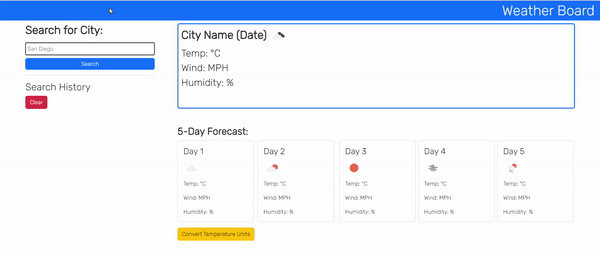

# weather-dashboard

## Technology Used
- html
- css
- javascript
- bootstrap - v5.3
- Google Fonts - for Rubik font
- day.js - for converting unix time
- 5 day weather forecast server api - https://openweathermap.org/forecast5
- [ezgif](https://ezgif.com/): to convert a screen recording to gif file for demo listed here.

## Description 
This is a product of a challenge provided by UC Berkeley Extension Coding Bootcamp

This is for displaying weather dashboard.
It has input areas for the city the user want to search for. 
The user can find the search result in the card on the right, the current day weather and 5 day forecast for that city.

This was done while trying to accomplish following criteria:

### Acceptance Criteria
    - GIVEN a weather dashboard with form inputs
    1. WHEN I search for a city
    THEN I am presented with current and future conditions for that city and that city is added to the search history
    2. WHEN I view current weather conditions for that city
    THEN I am presented with the city name, the date, an icon representation of weather conditions, the temperature, the humidity, and the wind speed
    3. WHEN I view future weather conditions for that city
    THEN I am presented with a 5-day forecast that displays the date, an icon representation of weather conditions, the temperature, the wind speed, and the humidity
    4. WHEN I click on a city in the search history
    THEN I am again presented with current and future conditions for that city

### Deployed Website
[Deployed Website](https://moonjunsain.github.io/weather-dashboard/)

## Table of Contents

* [Installation](#installation)
* [Usage](#usage)
* [Learning Points](#learning-points)
* [Credits](#credits)
* [License](#license)

## Installation

N/A

## Usage 

Following is the demo of this app.
The user can search a city name in the input, and when the user clicks the search button, it displays current weather for that city followed by 5 day forecast for that city. The search history gets saved (no duplicate) to the local storage, and the user can click the history to get back the result. The user can also clear the history, and convert temperature units to celsius or fahrenheit 

## Learning Points
1. Use of api to extract data that I need from server side api
2. The root address http and https matter
3. Reading documentation from api host website 

## Credits

### June Moon
- Email: moonjunsain@gmail.com
- [Github](https://github.com/moonjunsain)
- [Linkedin](https://www.linkedin.com/in/june-moon-940538280/)

## License

MIT License

---

© 2023 edX Boot Camps LLC. Confidential and Proprietary. All Rights Reserved.